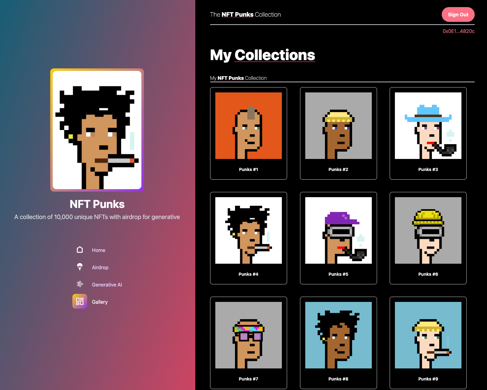

# NFT Minting Dapps with Airdrop using Merkle Tree

## Table of Contents

- [NFT Minting Dapps with Airdrop using Merkle Tree](#nft-minting-dapps-with-airdrop-using-merkle-tree)
  - [Table of Contents](#table-of-contents)
  - [Introduction](#introduction)
  - [Getting Started](#getting-started)
  - [Contract Overview](#contract-overview)
    - [`NFT` Contract](#nft-contract)
    - [`Airdrop` Contract](#airdrop-contract)
    - [`GeneratedNFT` Contract](#generatednft-contract)
  - [Usage](#usage)
  - [Contributing](#contributing)
  - [License](#license)

## Introduction

This project consists of three Solidity smart contracts that allow users to mint NFTs, participate in an airdrop using a Merkle tree, and mint Generative Art NFTs by burning the airdrop token . The contracts leverage ERC721 and ERC1155 standards to manage NFTs and airdrop tokens respectively. Let's dive into each contract's functionalities.

## Getting Started

To begin using the contracts, follow these steps:

1. Deploy the `NFT` contract with the specified cost for minting NFTs.
2. Deploy the `Airdrop` contract with the Merkle root and NFT contract address.
3. Deploy the `GeneratedNFT` contract with the airdrop contract address and minting cost.
4. Interact with the contracts' functions to participate in the airdrop and mint NFTs.

## Contract Overview

### `NFT` Contract

The NFT contract is an ERC721-compliant contract that allows users to mint NFTs by paying a certain cost in ether.

- Allows users to mint NFTs by paying a specified cost in ether.
- Users who possess airdrop tokens can mint NFTs for free.
- Manages NFT minting with or without airdrop tokens.

### `Airdrop` Contract

The Airdrop contract handles the airdrop mechanism. It utilizes an ERC1155 token standard, allowing efficient management of multiple token types. The airdrop functionality is based on a Merkle tree, where users can claim a predetermined number of airdrop tokens by providing a valid proof generated from the Merkle root.

- Implements a Merkle tree-based airdrop mechanism using ERC1155 tokens.
- Users who hold NFT tokens can claim additional airdrop tokens.
- Enables users to participate in the airdrop and receive tokens based on proofs.

### `GeneratedNFT` Contract

The GeneratedNFT contract is another ERC721 token contract that allows users to mint NFTs using AI and can mint the NFT by using their airdrop tokens.

- Allows users to mint NFTs using their airdrop tokens.
- Utilizes the `Airdrop` contract to enable free minting for airdrop token holders.
- Airdrop will be reduce by using token burning mechanism each time user minted NFT using their airdrop tokens

## Usage

To use these contracts, follow the steps outlined in the "Getting Started" section above. Interact with the contract functions to participate in the airdrop, claim airdrop tokens, and mint NFTs. Make sure to follow the rules and requirements for each contract's functionalities.

## Contributing

Contributions to this project are welcome! If you find any issues or have ideas for improvement, feel free to open an issue or submit a pull request.

## License

This project is licensed under the [SPDX-License-Identifier](LICENSE). You can find the license information in the LICENSE file.
